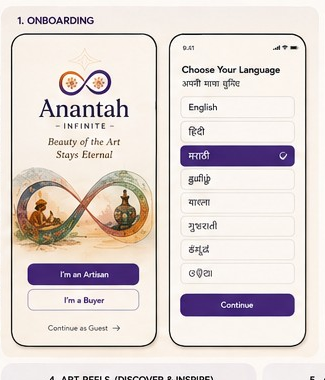
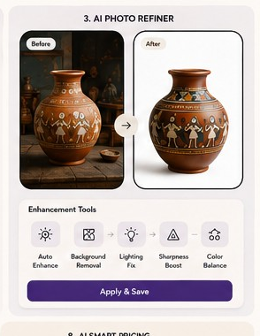

# 🪷 Anantah (अनंत) — AI Marketplace for Artisans

> **"Beauty of the Art Stays Eternal"**  
> Empowering marginalized Indian craftspeople by turning everyday smartphone photos into studio-grade e-commerce listings with local AI.

[](https://www.djangoproject.com/)
[](https://www.django-rest-framework.org/)
[](https://www.python.org/)
[](https://opencv.org/)
[](https://onnxruntime.ai/)
[](https://aiven.io/)

---

## 📖 Overview

**Anantah** is an end-to-end marketplace platform designed to bridge the digital divide for local Indian artisans. Often, talented craftspeople struggle to sell online because e-commerce platforms demand professional photography and complex product listing processes.

Anantah solves this with:
1. **Lightweight On-Device AI Photo Refinement**: Instantly strips cluttered backgrounds, corrects harsh shadows and lighting using adaptive histogram equalization (CLAHE), and places the handicraft on a crisp studio-white background.
2. **Inclusive, Multilingual Onboarding**: Audio-visual and language-first workflows tailored for artisans across India (English, Hindi, Marathi, Gujarati, Tamil).
3. **Direct Buyer Marketplace**: Connects conscious consumers directly with certified artisans, eliminating middlemen.

---

## 📸 Screenshots & Workflow

| 1. Multilingual & Role Onboarding | 2. AI Photo Refinement Studio |
| :---: | :---: |
|  |  |
| *Language selection and guided role setup* | *Raw craft photo transformed to studio catalog quality* |

---

## ✨ Key Features

- 🪄 **Automated Background Removal**: Powered by `rembg` running the optimized `u2netp` model on ONNX Runtime.
- 💡 **CLAHE Lighting Correction**: Transforms poorly lit indoor/outdoor craft photos into balanced studio lighting using OpenCV in the LAB color space.
- ⚡ **Low-Resource & CPU-Optimized Pipeline**:
  - Downscales high-resolution images for segmentation to stay within tight memory limits (< 8GB RAM).
  - Upscales resulting alpha masks back to original resolution to maintain fine craft details.
  - Limits execution threads (`OMP_NUM_THREADS=2`) and invokes explicit garbage collection to prevent out-of-memory crashes on modest hardware.
- 🌐 **Multilingual Frontend**: Native support for English, हिन्दी (Hindi), मराठी (Marathi), ગુજરાતી (Gujarati), and தமிழ் (Tamil).
- 🔐 **JWT Token Authentication**: Secure signup and login workflows with role separation (`artisan`, `buyer`, `admin`).
- 🛒 **Marketplace Feed**: Real-time product feed displaying craft details, pricing in ₹ INR, and AI-refined verification badges.

---

## 🛠️ Tech Stack

- **Backend Framework**: Python 3, Django 5, Django REST Framework (DRF)
- **Authentication**: `djangorestframework-simplejwt` (JWT Access & Refresh tokens)
- **Computer Vision & AI**: `rembg` (`u2netp`), `opencv-python-headless`, `Pillow`, `NumPy`, `onnxruntime`
- **Database**: MySQL (Compatible with local MySQL & Cloud DBs like Aiven)
- **Frontend**: Vanilla JavaScript (ES6+), Modern HTML5 & CSS3 Single-Page Application (SPA)

---

## 📁 Project Structure

```text
artisan-demo/
├── accounts/               # User authentication, roles & profile management
│   ├── models.py           # Custom User, ArtisanProfile, BuyerProfile
│   ├── serializers.py      # Serializers with atomic signup transaction
│   ├── urls.py             # Auth routes (/signup, /login, /me)
│   └── views.py            # SignupView, MeView
├── ai_services/            # Computer vision & AI enhancement modules
│   └── refiner.py          # rembg + CLAHE + OpenCV pipeline
├── anantah_core/           # Root Django project configuration
│   ├── settings.py         # App configurations, JWT, CORS & MySQL settings
│   ├── urls.py             # Root URL routing
│   └── wsgi.py             # WSGI deployment gateway
├── listings/               # Product catalog, listings & uploads
│   ├── models.py           # Product and Category models
│   ├── serializers.py      # Product serializers (media URL builder)
│   ├── urls.py             # Listing endpoints (/upload/)
│   └── views.py            # ProductUploadView (triggers AI refiner)
├── 01_onboarding.png       # UI Preview: Onboarding
├── 03_ai_photo_refiner.png # UI Preview: AI Refiner
├── config.js               # Frontend API base URL configuration
├── index.html              # Frontend Single Page Application
├── style.css               # Modern responsive styling & design tokens
├── manage.py               # Django management script
└── requirements.txt        # Python package dependencies
```

---

## 🚀 Getting Started

### 1. Prerequisites

- **Python 3.10+** installed on your system.
- **MySQL** installed locally or an active [Aiven MySQL](https://aiven.io/) instance.
- **Git** installed.

---

### 2. Clone the Repository

```bash
git clone https://github.com/Athility/artisan-demo.git
cd artisan-demo
```

---

### 3. Set Up Virtual Environment

#### On Windows (PowerShell / Command Prompt):
```powershell
python -m venv venv
.\venv\Scripts\activate
```

#### On Linux / macOS:
```bash
python3 -m venv venv
source venv/bin/activate
```

---

### 4. Install Dependencies

```bash
pip install -r requirements.txt
```

---

### 5. Configure Environment Variables

Create a `.env` file in the root directory (alongside `manage.py`):

```ini
SECRET_KEY=your_django_secret_key_here
DEBUG=True

# Database Configuration (MySQL / Aiven)
DB_NAME=defaultdb
DB_USER=avnadmin
DB_PASSWORD=your_database_password
DB_HOST=your_database_host.aivencloud.com
DB_PORT=3306
```

---

### 6. Run Migrations & Start Server

```bash
# Apply database migrations
python manage.py migrate

# Start the Django development server
python manage.py runserver
```

The backend API will be live at `http://127.0.0.1:8000/`.

---

### 7. Launch the Frontend

1. Ensure `config.js` points to your backend URL:
   ```javascript
   const CONFIG = {
       API_BASE_URL: 'http://127.0.0.1:8000/api'
   };
   ```
2. Open `index.html` directly in your browser or serve with Live Server in VS Code.

---

## 🔄 How to Pull New Updates

Whenever new changes are pushed to GitHub, run the following commands inside the project root directory (`c:\artisan-demo`):

```bash
# 1. Check current status and active branch
git status

# 2. Pull the latest commits for your active branch
git pull

# (Or pull from a specific branch like main or v2)
git pull origin main
# git pull origin v2

# 3. Update any newly added Python packages
pip install -r requirements.txt

# 4. Apply any new database schema migrations
python manage.py migrate
```

---

## 📡 API Reference

### Authentication (`/api/accounts/`)

| Method | Endpoint | Description | Auth Required |
| :--- | :--- | :--- | :--- |
| `POST` | `/api/accounts/signup/` | Register as Artisan or Buyer | No |
| `POST` | `/api/accounts/login/` | Obtain JWT access and refresh tokens | No |
| `POST` | `/api/accounts/login/refresh/` | Refresh expired access token | No |
| `GET` | `/api/accounts/me/` | Get authenticated user profile details | Yes (Bearer) |

### Listings & AI Refiner (`/api/listings/`)

| Method | Endpoint | Description | Auth Required |
| :--- | :--- | :--- | :--- |
| `GET` | `/api/listings/upload/` | List products (Artisans see own; Buyers see all) | Optional/Yes |
| `POST` | `/api/listings/upload/` | Upload craft photo & trigger AI refinement | Yes (Artisan only) |

#### Sample Upload Payload (Multipart / Form-Data):
- `title_en`: `"Handmade Terracotta Vase"`
- `price`: `750.00`
- `raw_image`: `[File Attachment]`

---

## 🗺️ Roadmap

- [ ] **Voice-to-Listing**: Multi-dialect Indian voice input (Whisper / Bhashini) to auto-fill title, craft description, and pricing.
- [ ] **Automated Translation**: Multi-lingual product description generation using Gemini API.
- [ ] **Augmented Reality (AR) Preview**: Allow buyers to place craft items virtually in their room.
- [ ] **Offline PWA Sync**: Offline image queueing for artisans in low-connectivity rural regions.

---

## 📄 License

This project was developed for demonstration and hackathon innovation purposes. Distributed under the MIT License.
