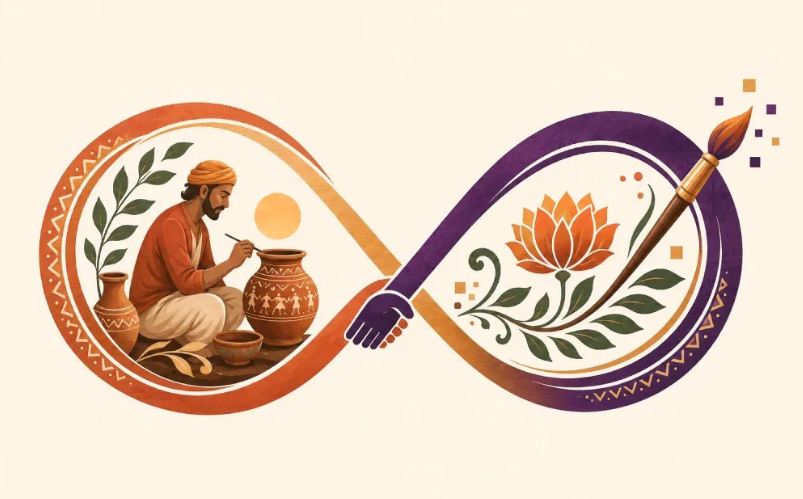

<div align="center">



# 🪷 ANANTAH

### Beauty of the Art Stays Eternal

AI-powered marketplace and digital cataloging for Indian artisans.

[](https://www.djangoproject.com/)
[](https://www.python.org/)
[](#)
[](#)
[](#)

</div>

## The Problem
Indian artisans hold generations of heritage, but often struggle to transition to the digital economy. Modern e-commerce platforms demand professional studio photography, fluent English product descriptions, and complex digital cataloging processes, creating a massive barrier to entry for local craftspeople.

## The Solution
Anantah eliminates these barriers by providing an intuitive, multilingual platform where artisans can use their smartphones to instantly generate premium, studio-grade listings. By automating the technical cataloging process with AI, Anantah connects conscious consumers directly with authentic craftspeople—with zero middlemen involved.

## 🚀 Core Features

<table>
<tr>
<td width="50%">

### 🎨 AI Product Studio
Transform everyday indoor/outdoor photos into polished, marketplace-ready visuals. Powered by on-device **ONNX Runtime** running `rembg` (U-2-Net) for background removal, and OpenCV for adaptive lighting correction (CLAHE) in the LAB color space.
</td>
<td width="50%">

### 🎙️ Voice Cataloging
Artisans can describe their products naturally using local language audio. **Groq Whisper** handles transcription and translation, while **Groq LLaMA** generates structured, bilingual SEO-optimized titles and descriptions.
</td>
</tr>

<tr>
<td>

### 🛍️ Artisan Marketplace
A premium, editorial-style digital storefront built entirely with Vanilla HTML/JS and CSS. Features a dedicated mobile-first search sheet, dynamic category filtering, and immersive product discovery.
</td>
<td>

### 💳 Integrated Commerce
End-to-end consumer purchasing workflow featuring secure cart management, buyer order tracking, and live payment processing integrated directly with **Razorpay**.
</td>
</tr>
</table>

## 🔄 Artisan Workflow

```text
📸 Capture Product (Smartphone)
       ↓
🤖 AI Enhancement (Background Removal & Lighting Correction)
       ↓
🎙️ Voice Cataloging (Native Language Audio)
       ↓
🌐 Groq Processing (Whisper Translation + LLaMA SEO Generation)
       ↓
📝 Review Bilingual Listing
       ↓
🛍️ Publish to Marketplace
       ↓
💳 Direct Customer Order (Razorpay)
```

## ⚙️ Technical Architecture

**Backend Infrastructure**
- **Framework**: Python 3, Django 5.0.14, Django REST Framework
- **Database**: MySQL (Production) / SQLite (Local)
- **Authentication**: JWT (SimpleJWT) with secure OTP verification
- **Deployment**: Configured for Vercel & Gunicorn environments

**AI & Processing Pipeline**
- **Vision**: `rembg` (U-2-Net), OpenCV-Python-Headless, Pillow, ONNX Runtime (CPU Optimized)
- **Voice & Language**: Groq API (Whisper large-v3 & LLaMA 3) with Hugging Face fallback
- **Storage**: Cloudinary Centralized Media Storage

**Frontend Architecture**
- **Stack**: Vanilla HTML5, CSS3, JavaScript (Zero-build SPA)
- **Styling**: Custom premium UI, CSS variables, mobile-first responsive design

---

<div align="center">
<i>Built with ❤️ for Indian Artisans</i>
</div>
