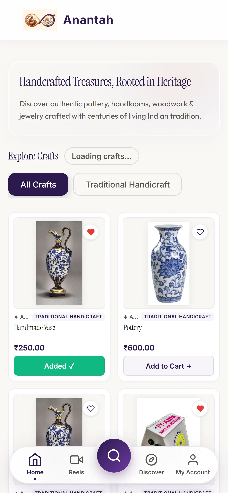
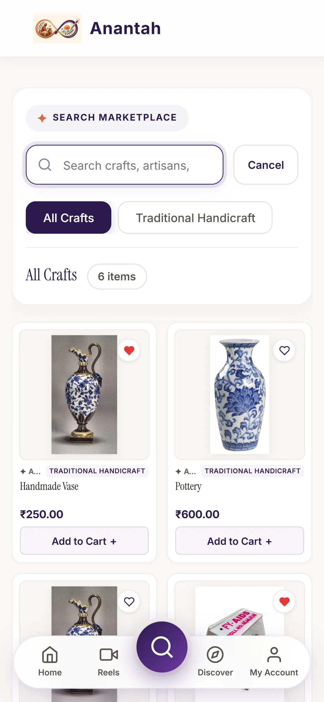
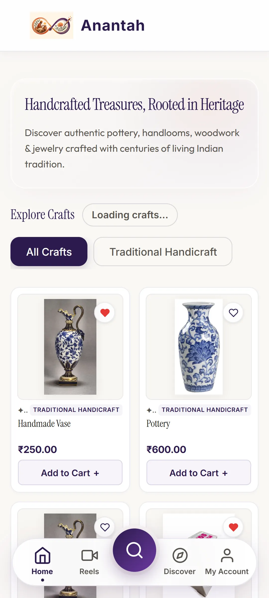
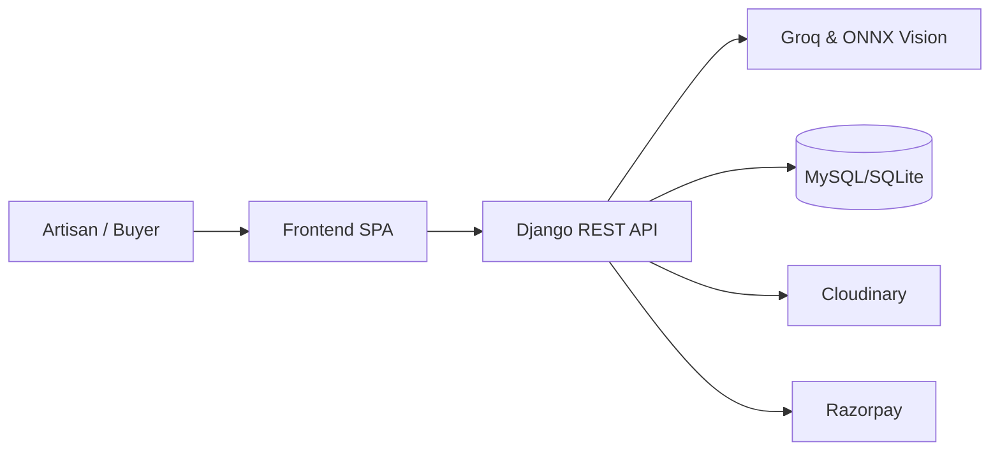

<div align="center">


# ANANTAH

### Beauty of the Art Stays Eternal

AI-powered marketplace and digital cataloging for Indian artisans.

[](#)
[](#)
[](#)
[](#)
[](#)
[](#)

<br>



</div>

## From Craft to Commerce

| The Challenge | Anantah |
|---|---|
| Difficult product photography | AI-assisted visual refinement |
| Language barriers | Voice-based cataloging |
| Complex listing creation | AI-generated product metadata |
| Limited digital reach | Artisan marketplace |

## ✨ What Anantah Does

<table>
<tr>
<td width="50%">

### 🎨 AI Product Studio
Removes cluttered backgrounds on-device via `rembg` (U-2-Net) and corrects lighting via OpenCV CLAHE.
</td>
<td width="50%">

### 🎙️ Voice Cataloging
Transcribes native language audio using Groq Whisper, generating SEO listings with Groq LLaMA 3.
</td>
</tr>

<tr>
<td>

### 🛍️ Artisan Marketplace
A zero-build, mobile-first Vanilla JS storefront featuring category filtering and a dedicated search sheet.
</td>
<td>

### 💳 Integrated Commerce
End-to-end checkout with secure cart management, buyer orders, and live Razorpay processing.
</td>
</tr>
</table>

## 🔄 How It Works

```text
📸 Product Photo + 🎙️ Voice
            ↓
       🤖 AI Processing
            ↓
      📝 Artisan Review
            ↓
       🛍️ Marketplace
            ↓
       🛒 Buyer Checkout
```

Anantah’s on-device ONNX runtime isolates the product and balances lighting, while Groq AI transforms local audio into bilingual English-Hindi listings, bridging the gap between traditional craft and digital commerce.

## 📸 Experience Anantah

<table>
<tr>
<td width="33%">

<p align="center"><b>Artisan Marketplace</b></p>
</td>
<td width="33%">

<p align="center"><b>Mobile Search</b></p>
</td>
<td width="33%">

<p align="center"><b>AI Product Studio</b></p>
</td>
</tr>
</table>

## ⚙️ Technology

| Layer | Technology |
|---|---|
| Frontend | HTML5, CSS3, Vanilla JS SPA |
| Backend | Python 3, Django 5.0, DRF |
| Database | MySQL (Production), SQLite (Local) |
| AI | Groq Whisper large-v3 & LLaMA 3 |
| Image Processing | `rembg`, ONNX Runtime, OpenCV, Pillow |
| Storage | Cloudinary |
| Payments | Razorpay |
| Deployment | Vercel (Frontend rewrites), Gunicorn |

## 🏗 Architecture



## 🔐 Security & Reliability

* JWT authentication with rotation and simplejwt token handling
* Secure OTP-based login and password resets
* Live Razorpay webhook signature validation
* Cross-Site Request Forgery (CSRF) & XSS protection
* File validation and sanitization for uploads

**67 tests passing** (Django standard & custom test suite).

## 🚀 Quick Start

```bash
git clone https://github.com/your-org/anantah.git
cd anantah

python -m venv venv
source venv/bin/activate  # On Windows: venv\Scripts\activate
pip install -r requirements.txt

python manage.py migrate
python manage.py runserver
```

<details>
<summary>Environment Variables (.env)</summary>

```env
SECRET_KEY=your-secret-key
DEBUG=True
DB_NAME=anantah_db
DB_USER=root
DB_PASSWORD=
DB_HOST=127.0.0.1
DB_PORT=3306
GROQ_API_KEY=your_groq_key
HF_API_TOKEN=your_hf_token
RAZORPAY_KEY_ID=your_razorpay_key
RAZORPAY_KEY_SECRET=your_razorpay_secret
CLOUDINARY_CLOUD_NAME=your_cloudinary_name
CLOUDINARY_API_KEY=your_cloudinary_key
CLOUDINARY_API_SECRET=your_cloudinary_secret
```

</details>

## 📁 Project Structure

```text
anantah/
├── accounts/        # Authentication & OTP verification
├── ai_services/     # Groq language processing & ONNX vision
├── anantah_core/    # Django configuration & settings
├── cart/            # Cart management logic
├── docs/images/     # Documentation assets
├── listings/        # Product catalog & API endpoints
├── payments/        # Razorpay integration
├── wishlist/        # User wishlists
├── index.html       # Vanilla JS Frontend SPA
├── style.css        # Premium custom CSS properties
├── config.js        # API routing
└── manage.py        # Django entrypoint
```

<br>
<div align="center">

### 🪷 Anantah
**Beauty of the Art Stays Eternal**

Built with ❤️ for Indian artisans.

</div>
